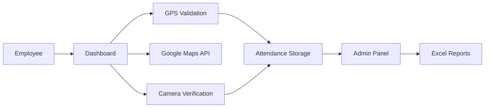
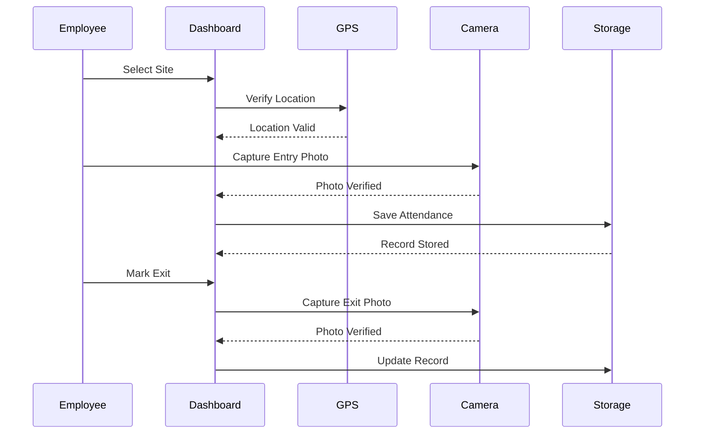
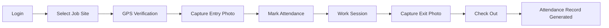

<div align="center">

# 📍 Employee Auth

### GPS-Based Employee Attendance & Field Workforce Tracking System

Secure employee check-in/check-out with GPS verification, live location validation, photo capture authentication, attendance analytics, and admin reporting.

### 🌐 Live Demo

https://mainakdebnath6.github.io/Employee-Auth/


</div>

---

# 🚀 Overview

Employee Auth is a location-aware attendance management platform designed for field engineers and remote workforce tracking.

The application ensures employees can mark attendance only when physically present at an assigned work location using:

- 📍 GPS Location Verification
- 📸 Photo Authentication
- 🗺 Google Maps Integration
- 📊 Attendance Analytics
- 📤 Excel Export Reports
- 👨‍💼 Admin Monitoring Dashboard

The solution eliminates manual attendance fraud and improves accountability for on-site engineering teams.

---

# ✨ Key Features

## 📍 GPS-Based Attendance

- Live location tracking
- Site location selection using Google Maps
- Geofencing validation
- Attendance allowed only within 400m radius

---

## 📸 Photo Verification

- Camera integration
- Entry photo capture
- Exit photo capture
- Front/Rear camera support

---

## 🗺 Interactive Map System

- Google Maps API integration
- Location search
- Place autocomplete
- ZIP code extraction

---

## 📊 Attendance Dashboard

Track:

- Today's Attendance
- Last 7 Days
- Last 30 Days
- Total Records

Real-time updates without page refresh.

---

## 👤 Profile Management

Employees can:

- Update Full Name
- Contact Information
- Personal Details

Profile data is persisted locally.

---

## 👨‍💼 Admin Dashboard

Admin users can:

- View All Employees
- Monitor Attendance Records
- Review Site Visits
- Track Working Duration
- Export Excel Reports
- Manage User Issues

---

## 📤 Excel Export

Generate attendance reports using:

- SheetJS (XLSX)
- One-click export
- Ready for HR processing

---

# 🏗️ System Architecture



---

# 🔄 Attendance Workflow



---

# 📈 Attendance Lifecycle



---

# 🛠 Tech Stack

## Frontend

- HTML5
- CSS3
- Bootstrap 5
- JavaScript (ES6)

## APIs

- Google Maps JavaScript API
- Places API
- Geolocation API

## Libraries

- jQuery
- GSAP
- SheetJS (XLSX)

## Browser APIs

- Camera API
- Geolocation API
- Local Storage API

---

# 📊 Feature Breakdown

| Module | Functionality |
|----------|-------------|
| Authentication | Session-based login |
| Attendance | Entry & Exit Tracking |
| Maps | Site Selection |
| GPS | Geofencing Validation |
| Camera | Identity Verification |
| Reports | Excel Export |
| Admin | User Monitoring |
| Help Desk | Issue Reporting |

---

# 📁 Project Structure

```bash
Employee-Auth
│
├── index.html
├── dashboard.html
│
├── assets/
│   ├── css/
│   ├── js/
│   └── images/
│
├── README.md
│
└── Bureau_Veritas.svg.png
```

---

# 🔒 Security Measures

### Geofencing Protection

Only allows attendance within:

```text
400 Meter Radius
```

### Identity Verification

- Mandatory photo capture
- Entry image
- Exit image

### Role-Based Access

- Employee Access
- Admin Access

### Data Integrity

- Attendance timestamps
- Location validation
- Session-based control

---

# 📱 Responsive Design

Optimized for:

- 📱 Mobile Devices
- 💻 Laptops
- 🖥 Desktop Screens
- 📟 Tablets

---

# 🚀 Future Enhancements

- Cloud Database Integration
- Employee Live Tracking
- Face Recognition Attendance
- QR Code Site Verification
- Attendance Notifications
- Multi-Admin Support
- Analytics Dashboard
- REST API Backend

---

# 🎯 Real-World Use Cases

### Engineering Teams

Track field engineers across multiple project sites.

### Construction Industry

Verify worker presence at designated locations.

### Service & Maintenance Teams

Monitor technician visits and service duration.

### Logistics Workforce

Attendance verification for distributed teams.

---

# 👨‍💻 Developer

### Mainak Debnath

B.Tech CSE Student

Full Stack Developer | MERN Stack | AI/ML Enthusiast

GitHub: https://github.com/MainakDebnath6

---

# ⭐ Support

If you found this project useful:

```bash
⭐ Star the Repository

🍴 Fork the Project

🚀 Contribute
```

---

<div align="center">

### Secure Attendance. Verified Presence. Better Workforce Management.

⭐ Don't forget to star this repository.

</div>
